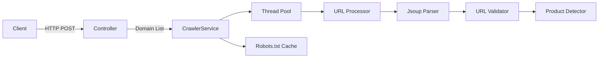

# E-Commerce Product URL Crawler

[](https://openjdk.org/)
[](https://spring.io/projects/spring-boot)

## Overview

This project implements a web crawler service using Java and Spring Boot. The crawler is designed to extract product URLs from specified e-commerce domains while respecting the `robots.txt` file of each domain. It supports concurrent crawling and includes error handling for various HTTP status codes.

## Table of Contents
- [Features](#features)
- [Technologies Used](#technologies-used)
- [Quick Start](#quick-start)
- [API Documentation](#api-documentation)
- [Configuration](#configuration)
- [Developer Guide](#developer-guide)
- [Architecture](#architecture)
- [Best Practices](#best-practices)
- [Limitations](#limitations)
- [License](#license)
- [Acknowledgments](#acknowledgments)

## Features

✔ **Domain-focused Crawling** - Stays within specified domains  
✔ **Intelligent URL Discovery** - Identifies product pages using multiple patterns  
✔ **Parallel Processing** - Configurable thread pool for efficient crawling  
✔ **Asynchronous crawling** - Asynchronous crawling using `CompletableFuture`   
✔ **Polite Crawler** - Respects robots.txt and caching to minimize repeated requests  
✔ **Resilient Design** - Automatic retries for failed requests    
✔ **Rate Limiting** - Rate limiting to prevent overwhelming target servers    
✔ **Error Handling** - Error handling for common HTTP errors (e.g., 429, 500)

## Technologies Used

- Java 17
- Spring Boot
- Jsoup (for HTML parsing)
- SLF4J (for logging)
- Maven (for dependency management)


## Quick Start

### Prerequisites
- Java 17+
- Maven 3.6+

### Installation
1. **Clone the repository**:
   ```bash
   git clone https://github.com/manvendrapres/Ecommerce-WebCrawler.git
   cd Ecommerce-WebCrawler
    ```

2. **Build the project**:
   ```bash
   mvn clean install
   ```

3. **Run the application**:
   ```bash
   mvn spring-boot:run
   ```


## API Documentation

### POST `/api/crawler/crawl`
**Request:**
```json
[
    "https://www.virgio.com",
    "https://www.tatacliq.com"
]
```

**Response:**
```json
{
  "www.virgio.com":[
      "https://www.virgio.com/product/123",
      "https://www.virgio.com/p/456"
    ]
}
```


### Example Request using Postman
1. Set the request type to `POST`.
2. Enter the URL: `http://localhost:8092/api/crawler/crawl`.
3. In the body, select `raw` and set the type to `JSON`, then enter the JSON array of domains:
   ```json
   [
       "https://www.flipkart.com",
       "https://www.amazon.com"
   ]
   ```

4. Send the request and observe the response containing the crawled product URLs.

## Logging
The application uses SLF4J for logging. You can adjust the logging level in the `application.properties` file:
```properties
logging.level.root=INFO
logging.level.com.example=DEBUG
```

## Error Handling
The crawler handles various HTTP errors:
- **429 Too Many Requests**: The crawler will wait and retry after a specified delay.
- **500 Internal Server Error**: The crawler logs the error and continues.
- Other errors are logged as errors.


## Configuration

Edit `application.yml`:
```yaml
crawler:
  max-depth: 2
  max-threads: 10
  request-delay-ms: 2000
  retry-delay-ms: 5000
  user-agent: "Mozilla/5.0 (compatible; EcommerceCrawler/1.0)"
  
  product-patterns:
    - "/product/"
    - "/p/"
    - "/item/"
    - "/prod/"
```

## Developer Guide


<details>
<summary>Click to view [DEVELOPER_GUIDE] for complete code explanation and architecture details</summary>

# Developer Guide

## Core Components

### 1. CrawlerService
```java
public class CrawlerService {
    private final ExecutorService executorService;
    private final Set<String> visitedUrls;
    private final Map<String, Set<String>> robotsCache;
    
    public CompletableFuture<Set<String>> crawl(String domain) {
        // Implementation
    }
}
```
- `executorService`: Manages thread pool for parallel crawling
- `visitedUrls`: Thread-safe set for URL deduplication
- `robotsCache`: Stores parsed robots.txt rules

### 2. Crawling Logic
```java
private CompletableFuture<Set<String>> crawl(String url, Set<String> productUrls, 
                                           int depth, String targetDomain) {
    // 1. Depth and URL validation
    // 2. robots.txt check
    // 3. HTML fetching with Jsoup
    // 4. Link extraction and processing
    // 5. Recursive child crawling
}
```

### 3. URL Processing Pipeline
1. Convert to absolute URLs: `link.attr("abs:href")`
2. Validate domain: `targetDomain.equals(getDomain(url))`
3. Check product patterns: `url.contains(pattern)`
4. Normalize URL: `new URL(url).getProtocol() + "://" + host + path`

## Key Algorithms

### Breadth-First Search (BFS)
- Processes pages level by level up to `MAX_DEPTH`
- Uses `ConcurrentHashMap` for thread-safe visited URLs tracking

### Parallel Execution
```java
CompletableFuture.supplyAsync(() -> {
    // Crawling work
}, executorService);
```

## Error Handling
- HTTP 429: Automatic retry after delay
- HTTP 500: Log and skip
- Timeouts: Configurable timeout threshold

</details>

## Architecture



## Best Practices

### Crawling Etiquette
1. Always check `robots.txt` first
2. Respect `Crawl-Delay` directives

### Performance Tips
- Tune `max-threads` based on server capacity
- Adjust `request-delay-ms` for target sites
- Monitor memory usage for large crawls

## Limitations

1. **JavaScript Content**: Cannot process JS-rendered pages
2. **Authentication**: Doesn't handle logged-in states
3. **CAPTCHAs**: No automatic CAPTCHA solving

## License
MIT License - See [LICENSE](LICENSE.md) for full text.

## Acknowledgments
- [Jsoup](https://jsoup.org/) for HTML parsing.
- [Spring Boot](https://spring.io/projects/spring-boot) for building the application.
```

